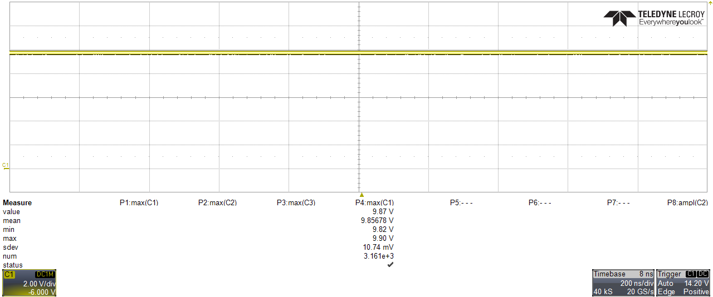
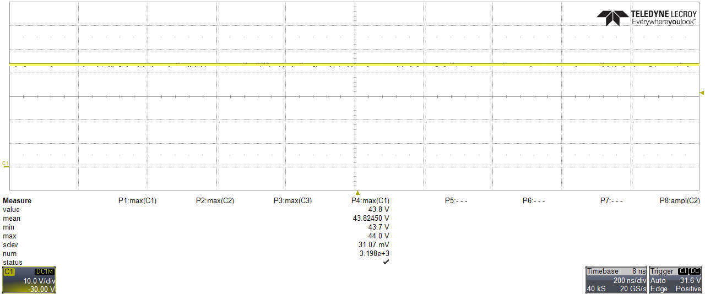
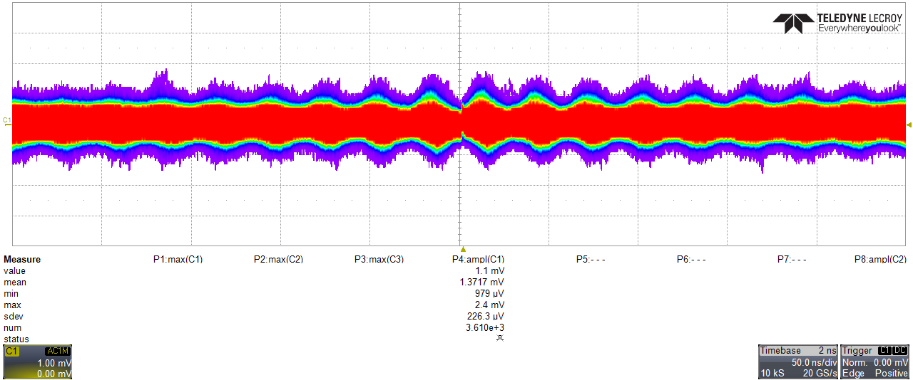
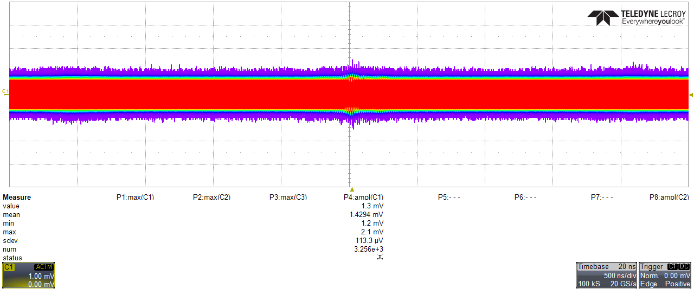

# Development and Characterization of an ESP32-Controlled High-Voltage Bias Unit for SiPM Applications

**Student:** Han Sijia  
**Project:** Compact programmable high-voltage power supply and monitor for SiPM biasing  
**Platform:** NodeMCU ESP-32S v1.1 / ESP-WROOM-32  
**Design tools:** LTspice, Altium Designer, Arduino IDE  

## Abstract

A compact programmable high-voltage bias unit for silicon photomultipliers (SiPMs) was designed, assembled, integrated with an ESP32 controller, and experimentally characterized. The work included circuit simulation in LTspice, schematic capture and printed-circuit-board design in Altium Designer, PCB assembly, connection to a NodeMCU ESP-32S controller, development of embedded firmware, implementation of a mobile-oriented web interface, and calibration of the voltage and current monitoring channels.

The high-voltage stage provides an adjustable output in the range of approximately 0–80 V. The ESP32 uses its internal DAC to set the output voltage, two ADC1 channels to monitor the output voltage and load current, and Wi-Fi to provide a standalone web interface. Calibration measurements were performed both without an external load and with a 47.22 kΩ resistive load. A Keithley 6485 picoammeter was used as the reference instrument for current measurements. The experimental results showed good linearity of the analog voltage- and current-monitoring circuits. The main residual errors were associated with the non-linearity of the ESP32 ADC and with supply-voltage variation under load. These effects were compensated in firmware by calibration lookup tables, digital filtering, and a slow closed-loop correction of the DAC code using the measured output voltage.

## 1. Introduction and objectives

SiPMs require a stable and accurately adjustable bias voltage, typically in the range of several tens of volts, while drawing relatively small currents. For laboratory use it is convenient to combine the high-voltage converter, voltage and current monitoring, digital control, and user interface in a compact unit.

The objectives of this work were:

1. To study and simulate a compact high-voltage converter suitable for SiPM biasing.
2. To develop the complete electrical schematic and PCB layout.
3. To assemble and test the PCB.
4. To integrate the high-voltage board with an ESP32-based controller.
5. To implement digital setting of the output voltage and monitoring of output voltage and current.
6. To develop a web interface suitable for operation from a mobile phone or computer.
7. To calibrate the control and monitoring channels and characterize the unit under no-load and resistive-load conditions.
8. To investigate the influence of the low-voltage power source on the observed output noise.

## 2. Circuit development and simulation

The high-voltage converter was first studied using LTspice. The simulation stage was used to verify the basic boost-converter operation, the feedback network, the output-voltage control range, and the expected behavior of the monitoring nodes before PCB fabrication.

The final circuit is based on an LT3482 high-voltage DC/DC converter. The design includes three analog interface paths between the converter and the ESP32 controller:

- **Voltage control:** ESP32 DAC output → AD8606 buffer → 10 kΩ / 10 kΩ divider → CTRL input.
- **Voltage monitoring:** high-voltage output → 1 MΩ / 33 kΩ divider → AD8606 buffer → ESP32 ADC1.
- **Current monitoring:** converter MON output → 6.2 kΩ current-to-voltage resistor → AD8606 buffer → ESP32 ADC1.

A separate digital line controls the converter shutdown input.

The 10 kΩ / 10 kΩ divider in the control path reduces the ESP32 DAC voltage by approximately a factor of two. During measurements the ratio between the DAC-buffer output and the CTRL voltage was found to be close to the expected 0.5 over the full operating range.

## 3. Schematic and PCB design

After simulation, the electrical schematic and PCB were developed in **Altium Designer**. Particular attention was paid to the separation of the switching power section from the low-level monitoring signals, short current loops in the converter section, high-voltage clearances, and convenient access to the control and monitoring signals.

The PCB provides connections for:

- low-voltage power;
- high-voltage output;
- analog control input;
- output-voltage monitor;
- output-current monitor;
- shutdown control;
- common ground and connection to the ESP32 controller.

The PCB was fabricated and assembled. After assembly, the converter board was connected to a NodeMCU ESP-32S v1.1 module based on the ESP-WROOM-32.

## 4. ESP32 integration

The final controller pin assignment is:

| Function | ESP32 pin | Description |
|---|---:|---|
| Voltage control | GPIO25 / DAC1 | Analog DAC output to the control buffer |
| Shutdown | GPIO27 | Enables/disables the high-voltage converter |
| Voltage monitor | GPIO34 / ADC1 | Reads buffered V_SENSE |
| Current monitor | GPIO35 / ADC1 | Reads buffered I_SENSE |
| HV status LED | GPIO2 | On-board indication of HV enabled state |

ADC1 pins were selected for the analog measurements so that the voltage and current channels remain available while Wi-Fi is active.

The converter board was tested from the regulated 3.3 V rail of the ESP32 module. With a 47.22 kΩ load and the output set near the top of the range, the measured 3.3 V rail changed from approximately 3.279 V with the high-voltage stage disabled to 3.147 V under load. This supply variation was later taken into account when improving the regulation algorithm.

## 5. Firmware

Firmware was developed in the Arduino IDE for the ESP32. The main functions are:

- generation of the control voltage using the internal 8-bit DAC;
- high-voltage ON/OFF control through the shutdown input;
- continuous measurement of output voltage and current using ADC1;
- digital filtering of the ADC readings;
- calibrated conversion of ADC codes into physical voltage and current;
- Wi-Fi access-point operation;
- embedded HTTP server and web interface;
- calibrated DAC lookup table for the requested output voltage;
- slow closed-loop correction of the DAC code using the measured output voltage.

### 5.1 ADC filtering

The ESP32 ADC has noticeable conversion noise and non-linearity. To obtain a stable display, the firmware uses two filtering stages:

1. 32 ADC conversions are averaged for every measurement update.
2. The averaged value is passed through a first-order IIR low-pass filter.

The measurement block is updated every 100 ms. The filtered values are used for the main web display, while the averaged raw ADC codes are also shown in the diagnostic area for calibration work.

### 5.2 Voltage-setting algorithm

The internal ESP32 DAC is only 8 bit, so the relationship between requested high voltage and DAC code was calibrated experimentally rather than calculated only from ideal component values. The firmware uses a piecewise-linear lookup table to obtain an initial DAC code.

The latest firmware additionally implements slow closed-loop correction. After the initial ramp and settling delay, the measured output voltage is compared with the requested voltage. When the error exceeds the defined dead band, the DAC target is adjusted by one code. This approach compensates for load-dependent voltage drop and low-voltage supply variation while retaining a smooth output ramp.

## 6. Web interface

The ESP32 operates as a standalone Wi-Fi access point and serves the control page directly. No external router or Internet connection is required.

The web interface was designed for convenient use on a mobile phone. It contains:

- a large circular indicator showing the **measured** high voltage;
- a green circle outline when the high-voltage output is enabled and a gray outline when disabled;
- a field for entering the requested voltage;
- an ON/OFF button;
- measured load current;
- status indication for ramping and regulation;
- a small diagnostic area displaying DAC code, target DAC code, ADC voltage code, ADC current code, and calibrated monitor values.

The diagnostic values were particularly useful during calibration because the raw converter behavior could be recorded without modifying the firmware for each measurement point.

## 7. Voltage calibration

### 7.1 Initial no-load characterization

The first calibration was performed without an external load. The following table summarizes the measured control and monitoring values.

| Requested voltage (V) | DAC code | GPIO25 (mV) | CTRL (mV) | V_SENSE pin (mV) | Real HV output (V) |
|---:|---:|---:|---:|---:|---:|
| 0 | 0 | 110 | 54 | 3.5 | 0.10 |
| 10 | 21 | 366 | 182 | 369 | 11.48 |
| 20 | 43 | 625 | 311 | 682 | 21.30 |
| 30 | 64 | 889 | 442 | 1000 | 31.25 |
| 40 | 85 | 1144 | 569 | 1307 | 40.81 |
| 50 | 107 | 1404 | 699 | 1621 | 50.40 |
| 60 | 128 | 1645 | 819 | 1911 | 59.40 |
| 70 | 149 | 1897 | 945 | 2215 | 68.90 |
| 80 | 171 | 2158 | 1073 | 2528 | 78.50 |

The analog V_SENSE divider and buffer showed very good linearity. The ideal divider ratio for 1 MΩ and 33 kΩ is 31.303, and the measured data were consistent with this value within the expected resistor and measurement tolerances.

The ESP32 ADC showed a low-end offset/non-linearity when the 11 dB attenuation range was used. In particular, `analogReadMilliVolts()` returned approximately 142 mV when the raw ADC code was already zero. Therefore, the firmware uses the raw ADC value for zero detection and applies the voltage calibration only above the zero region.

A linear calibration of the voltage-monitor channel was obtained from the measured points:

\[
V_{HV} \approx 0.0304459 \cdot V_{ADC,mV} + 0.7013
\]

where `V_ADC,mV` is the calibrated ESP32 ADC result in millivolts.

## 8. Characterization with a 47.22 kΩ load

A second measurement series was performed with a **47.22 kΩ** resistive load. The load current was measured independently using a **Keithley 6485 picoammeter**.

| SET (V) | DAC | ADC V | ADC I | VADC (mV) | IADC (mV) | GPIO25 (mV) | CTRL (mV) | Keithley current (mA) | V_SENSE pin (mV) | I_SENSE pin (mV) | Real HV (V) |
|---:|---:|---:|---:|---:|---:|---:|---:|---:|---:|---:|---:|
| 0 | 0 | 0 | 0 | 142 | 142 | 111 | 55 | 0.000 | 0.1 | 0 | 0.00 |
| 10 | 18 | 194 | 141 | 302 | 259 | 329 | 163 | 0.206 | 311 | 266 | 9.75 |
| 20 | 40 | 571 | 458 | 613 | 520 | 587 | 291 | 0.410 | 620 | 531 | 19.38 |
| 30 | 61 | 937 | 773 | 915 | 780 | 840 | 417 | 0.609 | 919 | 787 | 28.25 |
| 40 | 83 | 1337 | 1120 | 1248 | 1066 | 1115 | 552 | 0.823 | 1242 | 1064 | 38.78 |
| 50 | 106 | 1731 | 1459 | 1571 | 1349 | 1384 | 685 | 1.035 | 1555 | 1340 | 48.50 |
| 60 | 129 | 2109 | 1790 | 1885 | 1620 | 1638 | 813 | 1.239 | 1860 | 1604 | 58.00 |
| 70 | 152 | 2493 | 2133 | 2203 | 1903 | 1910 | 944 | 1.452 | 2172 | 1879 | 67.50 |
| 80 | 174 | 2877 | 2443 | 2519 | 2159 | 2152 | 1062 | 1.640 | 2450 | 2124 | 76.30 |

The open-loop measurements show an increasing difference between the requested and actual output voltage at higher load. At 80 V SET the measured output was 76.3 V. This behavior correlated with the observed reduction of the 3.3 V supply rail under load and motivated the addition of closed-loop voltage correction in firmware.

The loaded table above represents the characterization **before final verification of the new closed-loop regulation**. The closed-loop algorithm has been implemented in the current firmware and should be characterized in a subsequent measurement run.

## 9. Current-monitor calibration

The converter current-monitor output provides a current proportional to the total current drawn from the high-voltage node. A 6.2 kΩ resistor converts this monitor current into voltage. The measured I_SENSE values showed excellent agreement with the expected analog transfer function.

The ESP32 ADC itself was the dominant source of non-linearity, so a piecewise-linear calibration table was generated directly between averaged raw ADC code and the physically measured I_SENSE voltage:

| ADC I raw | Measured I_SENSE (mV) |
|---:|---:|
| 0 | 0 |
| 141 | 266 |
| 458 | 531 |
| 773 | 787 |
| 1120 | 1064 |
| 1459 | 1340 |
| 1790 | 1604 |
| 2133 | 1879 |
| 2443 | 2124 |

An important detail is that the current monitor measures not only the external load current but also the current through the V_SENSE divider. The divider resistance is approximately 1.033 MΩ. The firmware therefore calculates

\[
I_{load}=I_{total}-\frac{V_{HV}}{1.033\;M\Omega}.
\]

After this correction, the current calculated from I_SENSE agreed with the Keithley 6485 measurements to within approximately **2.5 µA** over the measured range up to about 1.64 mA. This confirms that the analog current-monitor circuit is sufficiently linear and that the remaining ADC non-linearity can be effectively corrected in software.

## 10. Oscilloscope measurements and power-source comparison

Oscilloscope measurements were performed to observe the output waveform and to compare the noise environment for different low-voltage power sources.

### 10.1 Output at approximately 10 V

**Figure 1.** Oscilloscope capture of the high-voltage output at approximately 10 V.

### 10.2 Output at approximately 43 V

**Figure 2.** Oscilloscope capture of the high-voltage output at approximately 43 V.

### 10.3 Power-source comparison at approximately 43 V

**Figure 3.** Oscilloscope capture with the ESP32 powered from a conventional USB source.

**Figure 4.** Oscilloscope capture with the ESP32 powered from a power bank.

These measurements were used as a qualitative comparison of the noise coupled through the low-voltage supply path. The captures demonstrate that the power source and grounding arrangement should be treated as part of the complete noise-performance evaluation. For a quantitative ripple specification, the measurement should be repeated with identical probe connection, bandwidth limit, time base, and grounding configuration.

## 11. Discussion

The project progressed through the complete engineering cycle: simulation, schematic design, PCB layout, assembly, embedded integration, firmware development, user-interface development, and experimental calibration.

Several practical effects became visible only after hardware integration:

- The nominal characteristics of the ESP32 DAC are insufficient for accurate open-loop voltage setting with an 8-bit DAC; an experimental lookup table significantly improves the initial voltage setting.
- The ESP32 ADC is not sufficiently linear over the full attenuated range for precision measurements without calibration.
- Averaging and IIR filtering considerably improve the stability of the displayed measurements.
- The analog V_SENSE and I_SENSE circuits themselves are highly linear; software calibration is mainly required to compensate the ESP32 conversion characteristics.
- The low-voltage supply rail changes under high-voltage load, which causes open-loop output droop. This effect can be reduced either by improving the low-voltage supply or by using feedback from V_SENSE.
- The current consumed by the voltage-monitor divider is not negligible compared with small SiPM currents and must be subtracted when reporting the external load current.

The latest firmware addresses the load-dependent voltage error using a slow closed-loop trim around the calibrated DAC lookup table. The initial LUT provides fast and predictable ramping, while the feedback loop compensates residual supply and load variation.

## 12. Conclusions

A working compact high-voltage bias unit with ESP32 control and monitoring was successfully developed and tested. The student completed the simulation and PCB design stages, assembled the hardware, and integrated the converter with the ESP32 controller. A dedicated firmware and mobile-oriented web interface were developed for voltage setting, high-voltage ON/OFF control, and real-time monitoring.

The voltage-monitoring and current-monitoring analog circuits demonstrated good linearity. Calibration of the ESP32 ADC and DAC was necessary to obtain useful measurement accuracy. Current measurements with a Keithley 6485 and a 47.22 kΩ load confirmed the validity of the current-monitoring scheme after correction for the current drawn by the voltage-sense divider.

The current firmware contains calibrated voltage and current conversion, digital filtering, smooth DAC ramping, and closed-loop voltage correction. The next useful step is a final characterization of the closed-loop output regulation over the full 0–80 V range and over several load currents, followed by a repeatable quantitative measurement of output ripple and noise.

## 13. Project files

The repository contains the principal project results:

- `HVunit_ESP32s.ino` — ESP32 firmware and embedded web interface;
- `calibration_table.xlsx` — calibration measurements;
- `10VDC.png` — oscilloscope capture at approximately 10 V;
- `43VDC.png` — oscilloscope capture at approximately 43 V;
- `43V_powerUSB.png` — 43 V measurement with conventional USB power;
- `43V_powerPBank.png` — 43 V measurement with power-bank power;
- `report_student_hansijia .docx` — student's initial report draft.

The final report intentionally describes the custom converter and controller developed in this project and does not rely on a commercial high-voltage module description.
